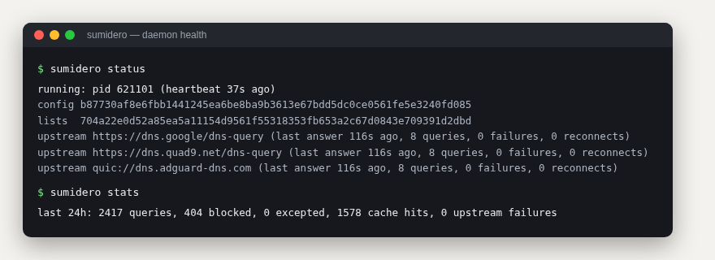
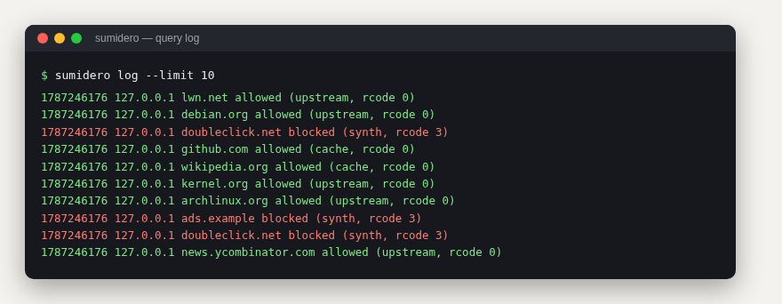
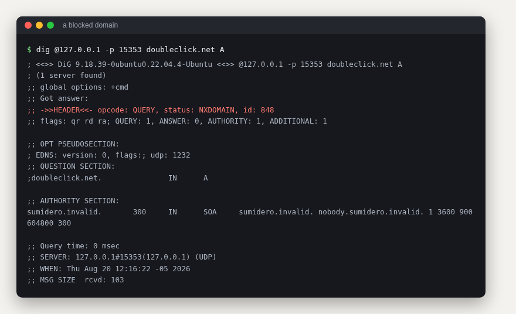

# sumidero

A DNS blocker for your network, in Rust. One binary, one TOML config, a
SQLite log. No web UI.



## Design position

- **The filesystem is the control plane.** One TOML file, read-only to
  the daemon; `SIGHUP` reloads it. No runtime-rewritten state.
- **Scriptable by contract.** Every subcommand takes `--json` and emits
  a versioned schema; exit codes carry meaning (`status` exits non-zero
  when the daemon is degraded).
- **Failures are loud.** A bad config, an unloadable blocklist, or an
  unbindable address stops startup instead of degrading silently. A bad
  reload keeps the old state; it never half-applies.

## Features

- **List-based blocking**: the ABP-DNS rule subset (`||domain^`, exact,
  `@@` exceptions, wildcards) plus hosts-file lists. Tested with 3.3M
  rules across 6 public lists. Blocked names answer `NXDOMAIN` with a
  synthetic SOA, so clients cache the negative answer.
- **Encrypted upstreams only** (DoH, DoQ). Each miss races all
  configured upstreams; the first usable answer wins. Dead connections —
  including silent hangs — are torn down and rebuilt in the background
  with backoff. An upstream that only answers SERVFAIL counts as down.
- **Cache with serve-stale**: LRU, bounded by entries and by estimated
  bytes (64 MiB) so it fits under a systemd `MemoryMax`. Expired entries
  are served for up to 30 minutes while a background refresh runs.
- **Load discipline**: concurrent misses for one name share a single
  upstream lookup; past a hard in-flight cap, queries get an immediate
  SERVFAIL instead of queueing unbounded work.
- **Safe-search enforcement** via CNAME rewrites.
- **SQLite query log and stats**, written off the hot path, with
  retention sweeps; under pressure it drops entries and says how many.
- **Shadow mode**: mirror live traffic to sumidero and your incumbent
  resolver, get a divergence report before switching port 53.
- **Hardened systemd unit** shipped in `packaging/`: `DynamicUser`,
  `ProtectSystem=strict`, syscall filter. `systemd-analyze security`
  scores it 1.6 (OK).



## Numbers

Measured on a 6-core aarch64 SBC with the full 3.3M-rule set; each
figure's command and context is in [PERF.md](PERF.md).

| what | measured |
|---|---:|
| steady RSS | 207 MB |
| RSS peak during reload (two engines coexist) | 429 MB |
| startup to serving | ~6 s |
| cache hit, end to end over UDP | ~0.2 ms |
| cache hits under 6-thread contention | 740k lookups/s |
| local burst, 64 clients | 7.4k qps, 0 dropped |

On misses, answer latency is the upstream's, as for any forwarder;
PERF.md documents that against the upstreams queried directly. Known
failure modes found during validation (dead-connection reuse, hung
upstreams, lying health counters, unbounded admission) each have a
reproducing test in the suite.

## Install

Linux with systemd, Rust 1.94+:

```sh
cargo build --release
sudo install -m 0755 target/release/sumidero /usr/local/bin/sumidero
sudo install -d -m 0755 /etc/sumidero
sudo install -m 0644 packaging/sumidero.service /etc/systemd/system/
sudo systemctl daemon-reload
```

`sumidero init` writes a commented starter config; `sumidero migrate`
converts an `AdGuardHome.yaml` and warns about anything it cannot carry
over.

```sh
sudo sumidero --config /etc/sumidero/config.toml init
sudo sumidero --config /etc/sumidero/config.toml check   # validate config + lists
sudo systemctl enable --now sumidero
```

A minimal config:

```toml
[server]
bind = ["0.0.0.0:53", "[::]:53"]
allow = ["192.168.0.0/24", "127.0.0.1/32", "::1/128"]

[filtering]
list_dir = "/var/lib/sumidero/lists"

[[filtering.lists]]
name = "hagezi-pro"
url = "https://cdn.jsdelivr.net/gh/hagezi/dns-blocklists@latest/adblock/pro.txt"

[upstreams]
servers = ["https://dns.google/dns-query", "quic://dns.adguard-dns.com"]
bootstrap = ["1.1.1.1", "9.9.9.9"]
timeout_ms = 5000

[database]
path = "/var/lib/sumidero/sumidero.sqlite"
```

Details, including `DynamicUser` traps and IPv6 bind semantics, are in
[docs/INSTALL.md](docs/INSTALL.md). Replacing a resolver that owns
port 53 today: [docs/CUTOVER.md](docs/CUTOVER.md).

## Day-to-day

```
sumidero status    # daemon health, per-upstream counters; exit code reflects it
sumidero log       # recent queries: who asked what, verdict, source, rcode
sumidero stats     # aggregates over a window
sumidero explain   # why a domain is (not) blocked, and by which rule
sumidero check     # validate config + lists without touching the daemon
sumidero reload    # validate, then SIGHUP the daemon
sumidero shadow    # divergence report against a reference resolver
```



## Workspace

| crate | purpose |
|---|---|
| `crates/filter` | pure filter engine (parser + matcher), no I/O |
| `crates/core` | daemon library: server, cache, upstream pool, SQLite |
| `crates/cli` | the `sumidero` binary |

Design decisions, including rejected ones, are in [DESIGN.md](DESIGN.md).

## License

MIT
